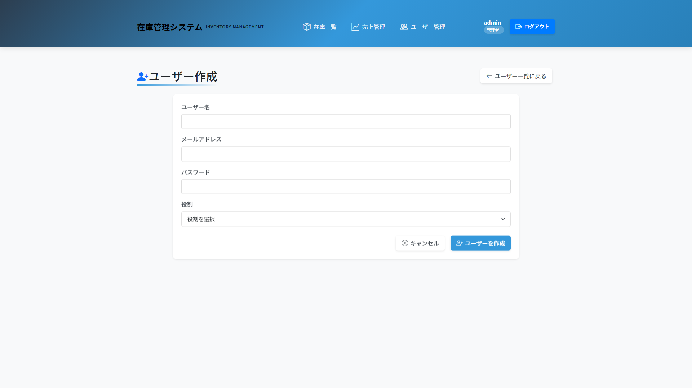
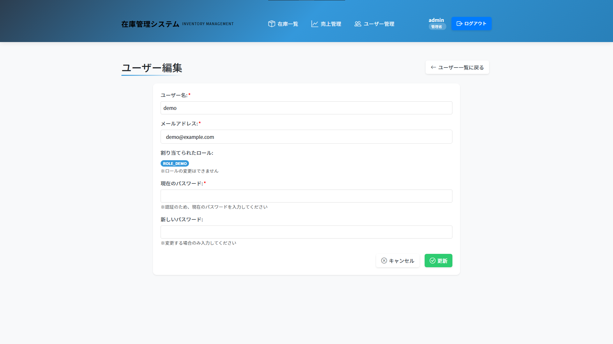
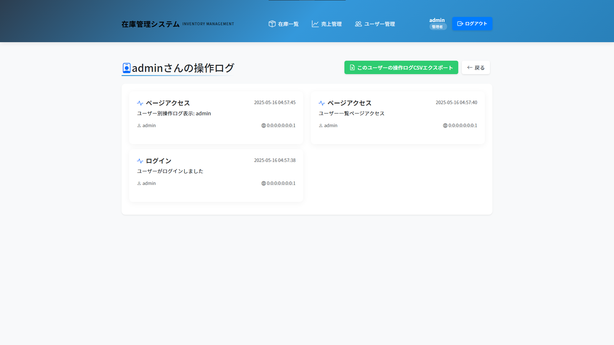
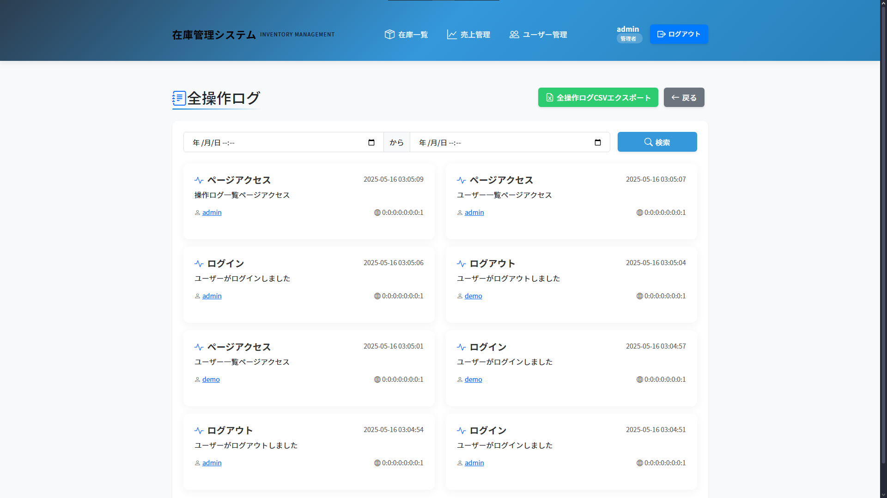
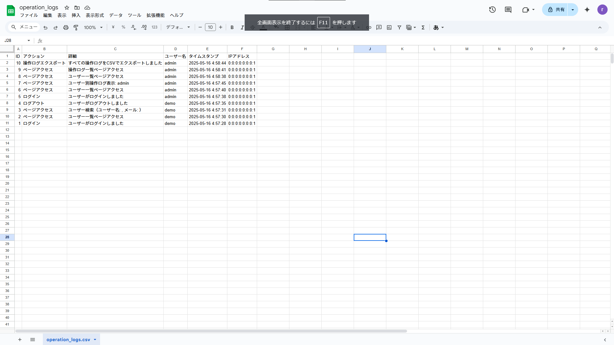
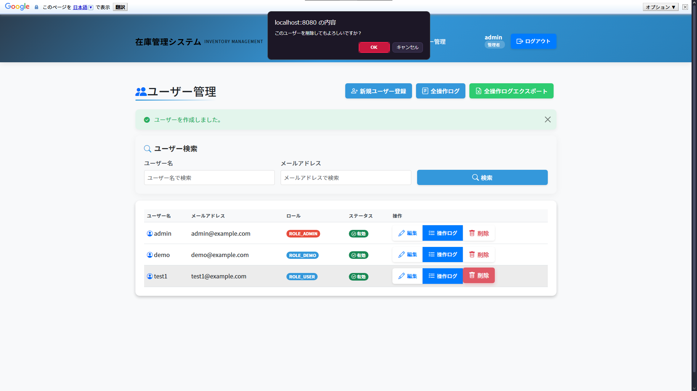
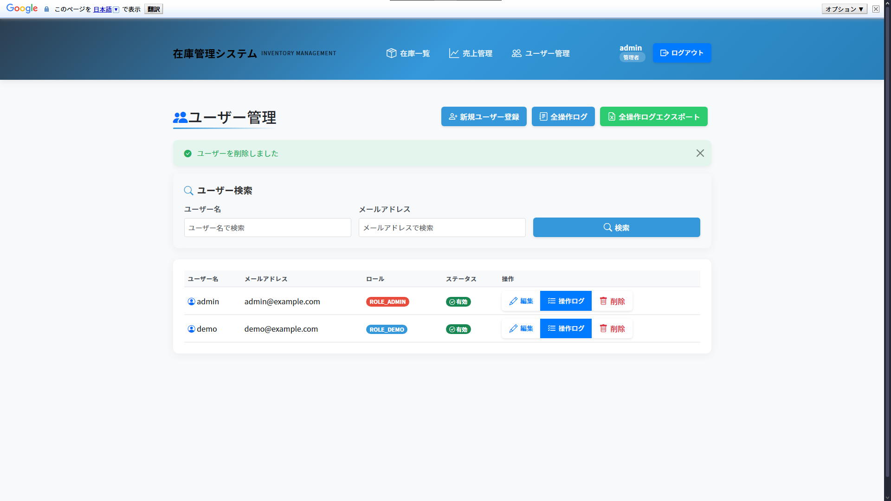
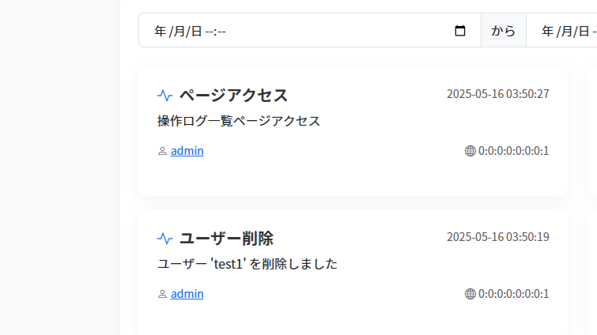

# 在庫管理システム

## プロジェクト概要
このプロジェクトは、ポートフォリオ用に作成した在庫管理システムです。
Spring Bootを使用したWebアプリケーションで、在庫の管理、CSVインポート/エクスポート、ユーザー管理などの機能を提供します。

## バージョン情報
- 現在のバージョン: 2.2
- 開発環境: H2 Database（開発）、MySQL（本番）
- セキュリティ設定: 適用済み

## 更新履歴
### バージョン 2.2
- UIレイアウトの統一（container-fluidからcontainerに変更）
- 商品編集画面でのカテゴリー選択機能の修正
- ユーザー編集画面でのエラー処理改善
- デモユーザーの実装

## 主な機能
- 在庫管理（追加・削除・編集）
- 在庫検索
- CSVファイルのインポート/エクスポート
- ユーザー管理（ログイン、権限管理）
- 操作ログの記録とエクスポート
- 売上管理とレポート機能

## 技術スタック
- フロントエンド
  - Thymeleaf
  - Bootstrap 5
  - JavaScript
- バックエンド
  - Spring Boot
  - Spring Security
  - Spring Data JPA
- データベース
  - MySQL（本番環境）
  - H2 Database（開発環境）
- セキュリティ
  - Spring Security
  - BCryptパスワードハッシュ
  - ロールベースアクセス制御

## セキュリティ設定
- 機密情報の管理
  - 本番環境の設定ファイルは除外（.gitignore）
  - パスワードは環境変数で管理
  - サンプル設定ファイル（application.properties.example）を提供
- データベースセキュリティ
  - 開発環境用の初期データのみ公開
  - 本番環境の接続情報は非公開
- ログ管理
  - ログファイルはGit管理外
  - 機密情報のログ出力を制限

## 開発環境のセットアップ
1. JDK 17以上をインストール
2. Mavenをインストール
3. プロジェクトをクローン
   ```bash
   git clone https://github.com/goodaymmm/Portfolio.git
   cd Portfolio
   ```
4. 設定ファイルの準備
   - `src/main/resources/application.properties.example`を`application.properties`にリネーム
   - 必要に応じて設定を変更（データベース接続情報、パスワードなど）
   - デフォルトでは開発環境用のH2データベース（インメモリ）が設定されています
5. `mvn spring-boot:run`でアプリケーションを起動

## ログイン情報（開発環境）
- 管理者アカウント
  - ユーザー名: admin
  - パスワード: admin
- デモユーザーアカウント
  - ユーザー名: demo
  - パスワード: demo
- ロール
  - ROLE_ADMIN: 管理者権限（全機能にアクセス可能）
  - ROLE_DEMO: デモユーザー権限
  （ユーザー管理、新規ユーザー登録・ユーザー情報編集以外の全機能にアクセス可能）
  - ROLE_MANAGER: マネージャー権限（在庫管理、売上管理にアクセス可能）
  - ROLE_USER: 一般ユーザー権限（在庫閲覧のみ可能）

## ポートフォリオ閲覧者向け情報
このシステムはポートフォリオとして本番環境をAWSにて公開しております。
デモ環境は自由にお試しいただけますが、実際の業務データは含まれていません。
テスト用のサンプルデータが入力された状態になっています。

システムの全機能をAWSにて体験していただくために、以下の方法を提供しています。

- **デモユーザーアカウント**：
  - 管理者とほぼ同等の権限がありますが、
  セキュリティ上の理由からユーザー管理機能は制限されています。
  ※ユーザー管理画面へのアクセスとユーザー検索のみが使用可能
  - 在庫管理、売上管理など主要機能はすべて利用可能です

- **ユーザー管理機能**：
  - セキュリティ上の理由からデモユーザーはアクセスできませんが、
  以下のスクリーンショットで機能をご確認いただけます
  - メールアドレスフォームがありますが、DBへ保存したり、
  アラートを発信したりはありません。

## ユーザー管理画面スクリーンショット
<details>
<summary><strong>ユーザー作成</strong> - 新規ユーザー登録</summary>
<br>



</details>

<details>
<summary><strong>ユーザー編集</strong> - 既存ユーザー編集</summary>
<br>



</details>

<details>
<summary><strong>個人ログ画面</strong> - 個人履歴</summary>
<br>



</details>

<details>
<summary><strong>全体ログ</strong> -　全ユーザー操作履歴</summary>
<br>



</details>

<details>
<summary><strong>ログCSV</strong> -　全ユーザー操作履歴CSV</summary>
<br>



</details>

<details>
<summary><strong>ユーザー削除</strong> - 削除操作</summary>
<br>




</details>


## AWS構成図
作成中

## AWS アーキテクチャ
<details>
<summary><strong>AWS構成について</strong> - 構成紹介</summary>
<br>

**アーキテクチャ特徴：**
- **セキュア3層構成**: Public Subnet（ALB）→ Private Subnet（EC2）→ Private Subnet（RDS）
- **DNS管理**: Route 53によるドメイン管理
- **負荷分散**: Application Load Balancerによる可用性向上
- **データベース**: RDS MySQL（完全プライベート配置）
- **セキュリティ**: NAT Gatewayによる一方向インターネットアクセス

**セキュリティ設計：**
- データベースを外部から完全に隔離
- セキュリティグループによる最小権限アクセス制御
- プライベートサブネット配置による攻撃面の最小化

</details>

## 基本機能
### 在庫管理
- 商品の追加、編集、削除
- 在庫数の自動計算
- 最小在庫数の設定と警告
- CSVファイルによる一括インポート/エクスポート

### 売上管理
- 売上記録
- 日次/週次/月次レポート
- CSVファイルによるエクスポート

### ユーザー管理
- ユーザーの追加、編集、削除
- 権限の割り当て
- 操作ログの記録とエクスポート

## 今後の拡張予定
- スマートフォン対応のレスポンシブデザイン実装
- モバイルアプリケーションの開発
- パフォーマンス最適化
- レポート機能の強化

## ライセンス
このプロジェクトはMITライセンスの下で公開されています。 
